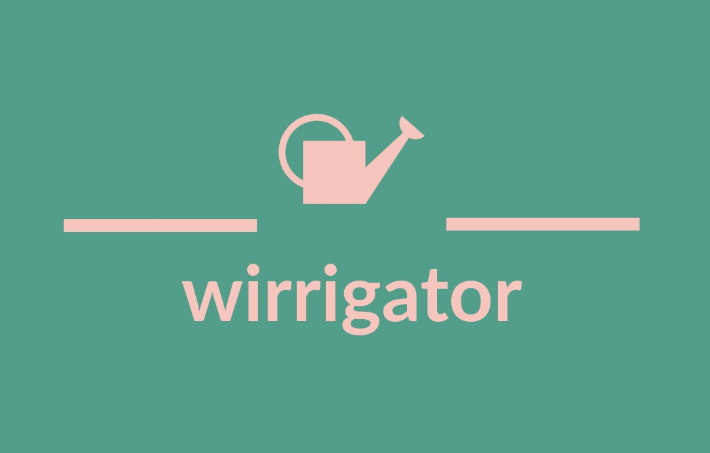

# Wirrigator

Little IoT irrigation project based on Wemos-D1 mini board ($2 board)

[](https://choosealicense.com/licenses/mit/)
[](https://github.com/brinth/wirrigator)
[](https://github.com/brinth/wirrigator)
[](https://github.com/brinth/wirrigator)
[](https://github.com/brinth/wirrigator)
[](https://github.com/brinth/wirrigator)
[](https://github.com/brinth/wirrigator)
[](https://github.com/brinth/wirrigator)
[](https://github.com/brinth/wirrigator)
[](https://github.com/brinth/wirrigator)


## Build

Requirements 
- [ESP8266-RTOS-SDK](https://docs.espressif.com/projects/esp8266-rtos-sdk/en/latest/get-started/index.html)
- bash
```bash
  make flash monitor
```
    
## License

[MIT](https://choosealicense.com/licenses/mit/)


## Authors

- [@brinth](https://www.github.com/brinth)


## Contributing

Contributions are always welcome!

See `contributing.md` for ways to get started.

Please adhere to this project's `code of conduct`.


## Documentation

[Documentation](https://linktodocumentation)

